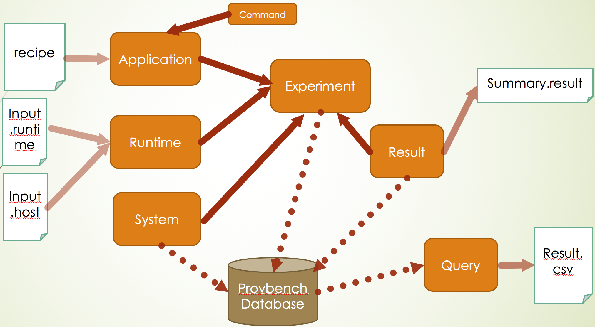
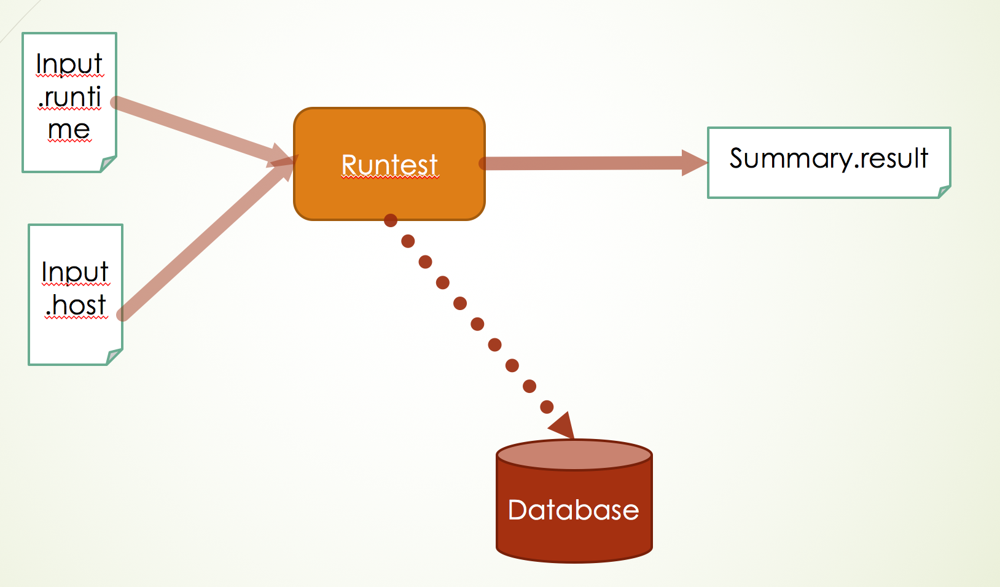
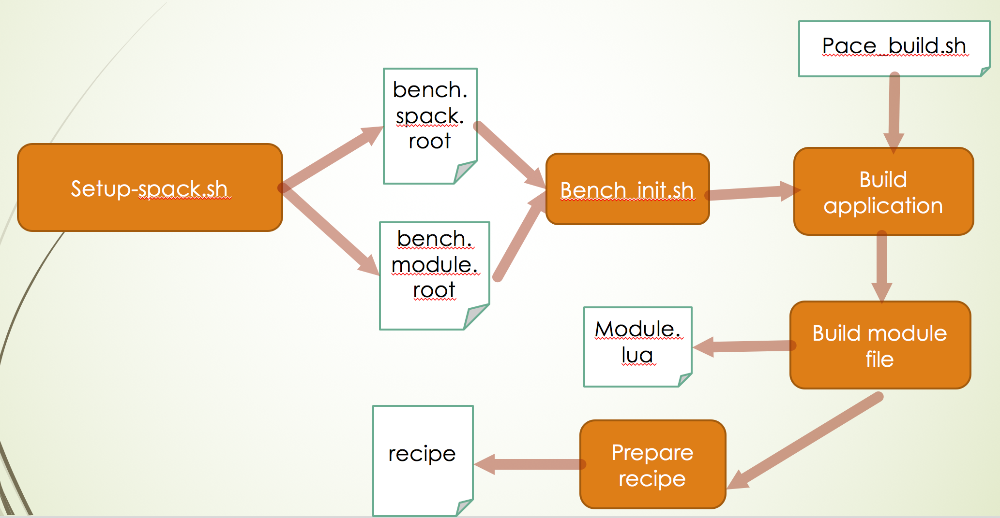

# PACE-ProBench

PACE-ProvBench is a Platform independent tool to quickly setup test suite/environment for usability and performance test on any new machines,
and it provides an easy way to compare the performance across multiple systems. When tests are running, all runtime
information including software, hardware, environment settings are recorded in the database, those data can be compared
afterwards. This project uses object oriented design to encapsulate the information relating to benchmark testing, and 
presents a clearer high-level representation, which aims to make the benchmark testing easier to extend and maintain, 
meantime the testing provenance is captured. 

Reach to Fang (Cherry) Liu (fang.liu@gatech.edu) if you have any questions.

## Checkout the repository

`git clone https://github.com/pace-gt/PACE-ProvBench.git`

Due to SPACK has some filesystem requirement, the current test needs to be done on a physical RHEL7 node
with local filesystem. 


## Few Terminologies
Experiment – each test run, usually one application with multiple runs

ROLEs – person who interacts with the framework

* Developer: develops and extends the framework in functionalities and design
* Contributor: builds the test suite and adds new applications
* User: run the tests and analyzes the data collected by the framework

RECIPE – defines how the application is run from command line

## System Requirements

* Easy to rebuild the software in a short time span with as little as possible manual steps:

  -- Use LLNL SPACK tool to build the underline compilers and libraries, using SPACK ENV to ensure automation and reproducibility (this is an optional step, Contributor can build software manually as needed)
  
  -- Provide the template build scripts and module files for Contributor to build the test suite on existing applications
  
  -- Allow easily to add new applications
* Information collected are permanently stored

  -- includes all software, hardware, running environment 
  
  -- information can be used to rebuild the tests
* Framework should be easy to extend

  -- Object-oriented programming style is adopted

## High Level Objects Design and workflow
This is for developer only, PACE-ProvBench has 7 main objects all under python package `<repo root>/SRC/pace/provbench`:

* Application : represents all information and functionalities for one application in test suite
* Runtime : provides the information related to each Experiment run
* System : captures hareware information for each individual host 
* Result: processes the performance result, e.g. average/mean/max/min time
* Database: interacts with database, construct the insert/update/select queries 
* Command: encapsultes the command line invokation for each application
* Experiment: includes all above objects, serves as the entry point for user interaction




## Repository Directory Structure
Please check [repository directory structure](repo_directory_struc.md) for details. 
It gives the detailed description on how each directory is for, and naming convention on how to put the new information in. 
 
## Building the initial test suite
Please check [Build Initial Test Suite](build_testsuite.md) for how to establish the initial benchmark suite with 
one application (leslie-spec), this initial test suite should allow user to experience the PACE-ProvBench framework 
in terms of functionalities. 

## Run tests as a user
Please check [User run test](run_test.md) for how to run a test. 




## Adding new application to PACE-ProvBench
The general steps are as follows, please check [add new application](add_new_application.md) session for details.
```
* build the application using the pace_build.sh from $PACEPROVBENCH/Application/Source
* add new module file under $PACEPROVBENCH/Application/Module/<appname>/<version>.lua
* add new recipe file under $PACEPROVBENCH/Application/Recipe/<appname>.inp
* follow the step on how to run a test 
```


## Query the database
User can access PACE-ProvBench database to gather performance data from the runs they had through the query interface. 
Please see [how to query the database](query_database.md) session for more details.

## Summary
* Current PACE-ProvBench provides:

  -- A way to build the test suite
  
  -- A way to integrate new test application
  
  -- A way to capture the provenance information and store permanently 

  -- A way to easy query the provenance information with given criteria
  
  -- A way to easy extend the framework

* Future work

  -- More test and validation need to be done
  
  -- More applications need to be added to test suite
  
  -- Extend the framework to handle more data analytics to answer HPC data center’ questions
  
  -- Publish the work in paper and github


Contributed by Fang (Cherry) Liu fang.liu@gatech.edu
